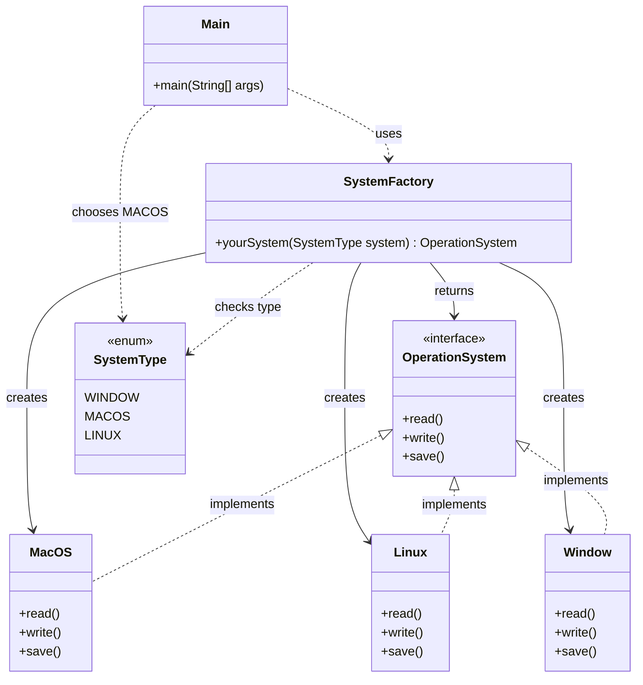
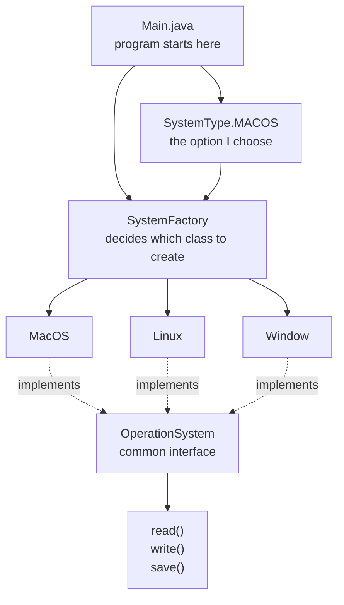

# Factory Pattern Map

This is the structure of my factory pattern example in UML diagram.



## Simple Flow



The main idea is:

```text
Main chooses a SystemType
SystemFactory creates the matching class
All system classes follow the OperationSystem interface
Main can use read, write, and save without caring which exact class was created
```
